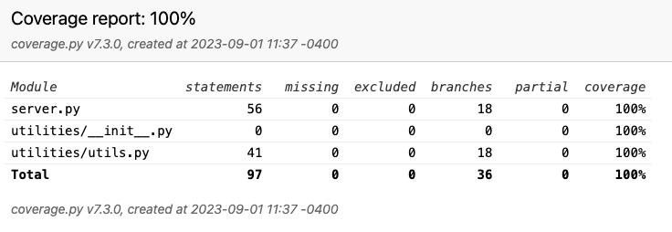
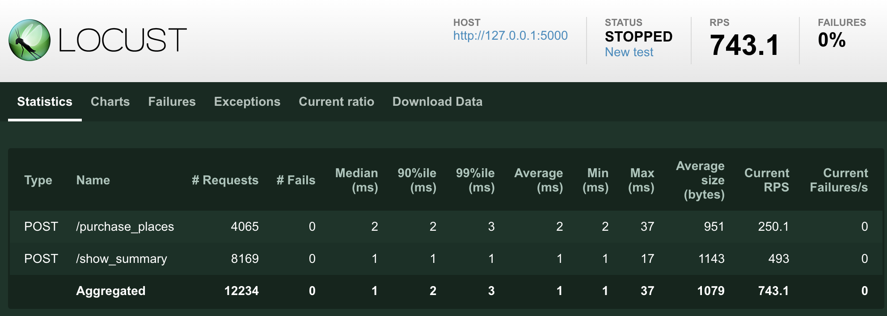

<h1 align="center">
GÜDLFT - Regional Outreach
 

</h1>

## Introduction

   GÜDLFT is a (fictional - for education purposes) digital platform for coordinating strength competition in North America and Australia. 

   This is a proof of concept (POC) project to show a light-weight version of our competition booking platform. The aim is the keep things as light as possible, and use feedback from the users to iterate.

## Getting Started

   This project uses the following technologies:

   * Python v3.x+
   
   * [Flask](https://flask.palletsprojects.com/en/1.1.x/)
   
   * [Virtual environment](https://virtualenv.pypa.io/en/stable/installation.html)

## Installation

   - After cloning, change into the directory and type <code>virtualenv .</code>. This will then set up a a virtual python environment within that directory.
   
   - Next, type <code>source bin/activate</code>. You should see that your command prompt has changed to the name of the folder. This means that you can install packages in here without affecting affecting files outside. To deactivate, type <code>deactivate</code>

   - Rather than hunting around for the packages you need, you can install in one step. Type <code>pip install -r requirements.txt</code>. This will install all the packages listed in the respective file. If you install a package, make sure others know by updating the requirements.txt file. An easy way to do this is <code>pip freeze > requirements.txt</code>

   - Flask requires that you set an environmental variable to the python file. However you do that, you'll want to set the file to be <code>server.py</code>. Check [here](https://flask.palletsprojects.com/en/1.1.x/quickstart/#a-minimal-application) for more details

   - You should now be ready to test the application. In the directory, type either <code>flask run</code> or <code>python -m flask run</code>. The app should respond with an address you should be able to go to using your browser.

## Current Setup

   The app is powered by JSON files. This is to get around having a DB until we actually need one. The main ones are:
   
   * [competitions.json](competitions.json) - list of competitions
   * [clubs.json](clubs.json) - list of clubs with relevant information. You can look here to see what email addresses the app will accept for login.
   * [booking.json](booking.json) - list of places booked by each club in each competition

## Branch management
- The Master branch should always have finished code running properly.
- A new branch must be created for any new feature or bug fix that would break the code
- Name new branches following the naming convention `<feature/bug/enhancement>/<descriptive_name>`.
- Before merging a branch to the Master branch, the code must be thoroughly tested, all the tests must pass.

## Testing

Thoroughly testing a program is ensuring it works in any possible situation. 
This program has been tested using various methods to guarantee its functioning.

The framework pytest as well at its extensions such as pytest-flask and 
pytest-mock have been used to create tests.

### Unit Tests
[Unit tests](tests/unit_test.py) check that simple units of code (functions, methods, class) work as expected, 
act accordingly to the specification and return the right values. 
They also check that the unit tested reacts appropriately given unexpected input values.

A unit test cannot be dependent on any functionality outside the unit being tested.

### Integration Tests
[Integration tests](tests/integration_test.py) check that units of code work well together to render the appropriate 
result given a situation.  
They also ensure that unexpected input will not cause the program to crash.

### Functional Tests
[Functional tests](tests/functional_test/functional_test.py) check the user perspective in any situation and ensure the user is able to perform
the action they intend and get the appropriate response in case of wrong input. 

In this program, the framework [Selenium](https://selenium-python.readthedocs.io/index.html) has been used to simulate the user activity on a browser.

> #### Launch the unit, integration and functional tests: 
> 1. Run the flask application (restart if needed)
> 2. Use the following command in the terminal: `pytest tests`

### Testing Coverage
Coverage reports to how well a program has been tested. The requirements indicate a minimum of 
60% coverage being acceptable.

The library [Coverage](https://coverage.readthedocs.io/en/7.3.0/) has been used to evaluate if this program has been properly tested.

> #### Launch the coverage test:
> 1. Use the following command in the terminal:  
> `pytest tests --cov=. --cov-report html`
> 2. Open the file `htmlcov/index.html` in the browser. 

Here's a screenshot of the latest coverage report: 

### Performance Tests
[Performance tests](tests/performance_test.py) assess the speed, responsiveness, and stability of an application when handling 
a particular workload.

In this program, the framework [Locust](https://docs.locust.io/en/stable/) has been used to test the performance of the application.

> #### Launch the performance test:
> 1. Use the following command in the terminal: 
`locust -f tests/performance_test.py` 
> 2. Follow the link provided to start the test:
> `http://0.0.0.0:8089`
> 3. Indicate the number of users and the spawn rate, as well as the host address:
> `http://127.0.0.1:5000`

Here's a screenshot of the latest performance test report: 

